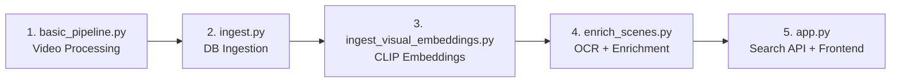

# Video Semantic Search Pipeline — Architecture Walkthrough

## Overview

This system processes raw video files into a searchable, multi-modal database index. Users can then search for specific moments using **text queries**, **uploaded images**, or **both combined**.

The pipeline runs in **5 sequential stages**, each building on the previous:



---

## Stage 1: Video Processing (`basic_pipeline.py`)

**Input:** Raw video files from `videos/` folder
**Output:** `processed/results/{video_name}/results.json`

For each video, four operations run sequentially:

### 1.1 Transcription (Whisper ASR)

[SimpleTranscriber](file:///d:/Education/UiS/MS%20Computer%20Science/Spring%202026,%204th/Code/BasePipeline/transcribe_all.py) converts audio → timestamped text segments.

| Field | Example |
|-------|---------|
| `start` | 5.2 |
| `end` | 8.7 |
| `text` | "The rig is called DeepSea Stavanger" |

Supports multiple ASR backends: `whisper`, `whisperx`, `distil-whisper`, `wav2vec`, `nemo`.

### 1.2 Scene Detection

[SceneDetector](file:///d:/Education/UiS/MS%20Computer%20Science/Spring%202026,%204th/Code/BasePipeline/scene_detector.py) analyzes frame-by-frame visual changes (content-aware threshold, default 30.0) to find shot boundaries.

**Output:** A list of scenes with start/end times and frame numbers.

### 1.3 Transcript ↔ Scene Alignment

[align_transcript_with_scenes](file:///d:/Education/UiS/MS%20Computer%20Science/Spring%202026,%204th/Code/BasePipeline/basic_pipeline.py#L241-L272) maps each transcript segment to the scene it overlaps with by comparing timestamps.

### 1.4 Keyframe Extraction

Saves a representative frame (JPG) from each scene to `processed/scenes/{video_name}/`.

### Caching

Uses a manifest file + video fingerprint (`file size + mtime`) to skip already-processed videos. Run with `force=True` to reprocess.

---

## Stage 2: Database Ingestion (`database/ingest.py`)

**Input:** `processed/results/*/results.json`
**Output:** Populated PostgreSQL tables

[DataIngester.ingest_video](file:///d:/Education/UiS/MS%20Computer%20Science/Spring%202026,%204th/Code/BasePipeline/database/ingest.py#L40-L244) reads each `results.json` and creates:

| Table | Records Created | Key Fields |
|-------|----------------|------------|
| `videos` | 1 per video | `filename`, `duration_seconds`, `whisper_model`, `video_fingerprint` |
| `scenes` | 1 per detected scene | `start_time`, `end_time`, `keyframe_path`, `video_id` (FK) |
| `transcript_segments` | 1 per speech segment | `text`, `start_time`, `end_time`, `scene_id` (FK), `video_id` (FK) |
| `embeddings` | 1 per transcript segment | `embedding` (1024-dim vector), `segment_id` (FK), `embedding_model` |

> [!IMPORTANT]
> During ingestion, **text embeddings** are generated on-the-fly using the **BAAI/bge-m3** model. These 1024-dimensional vectors power the text-based semantic search.

**Run:** `python database/ingest.py`

---

## Stage 3: Visual Embedding Ingestion (`database/ingest_visual_embeddings.py`)

**Input:** Scene keyframe images from `scenes.keyframe_path`
**Output:** Populated `visual_embeddings` table

[ingest_visual_embeddings](file:///d:/Education/UiS/MS%20Computer%20Science/Spring%202026,%204th/Code/BasePipeline/database/ingest_visual_embeddings.py) loads each keyframe image, passes it through the **OpenAI CLIP** model, and stores the resulting 512-dimensional vector.

| Table | Key Fields |
|-------|------------|
| `visual_embeddings` | `scene_id` (FK), `embedding` (512-dim), `keyframe_path`, `embedding_model` |

> [!IMPORTANT]
> Without this step, **image search will return 0 results**. This must be run after `ingest.py`.

**Run:** `python database/ingest_visual_embeddings.py`

---

## Stage 4: Scene Enrichment (`enrich_scenes.py`) — Optional

**Input:** Scene keyframes + transcript text from DB
**Output:** Updated DB records with additional metadata

[enrich_scenes.py](file:///d:/Education/UiS/MS%20Computer%20Science/Spring%202026,%204th/Code/BasePipeline/enrich_scenes.py) adds richer data to each scene:

| Enrichment | Tool | What It Does |
|------------|------|--------------|
| **OCR** | PaddleOCR | Extracts text visible in the keyframe (e.g., slide titles, labels) → stored in `scenes.ocr_text` |
| **Object Detection** | Open-vocab (placeholder) | Detects objects in the scene |
| **CLIP Embedding** | OpenCLIP | Alternative vision embedding path (same as Stage 3 but integrated) |
| **Text Re-embedding** | BAAI/bge-m3 | Re-embeds combined OCR + transcript text for richer semantic search |
| **Video Captioning** | LLaVA-NeXT (optional) | AI-generated scene description from sampled frames |

**Run:** `python enrich_scenes.py`

---

## Stage 5: Search API (`api/app.py`)

**Input:** User queries (text, images, or both)
**Output:** Ranked results with video timestamps

The [FastAPI application](file:///d:/Education/UiS/MS%20Computer%20Science/Spring%202026,%204th/Code/BasePipeline/api/app.py) serves the frontend and handles all search requests.

### Search Endpoints

| Endpoint | Method | What It Does |
|----------|--------|--------------|
| `/search/multimodal/quick` | GET | Text search combining semantic + visual matching |
| `/search/visual/image` | POST | Upload an image → find similar scenes (CLIP cosine similarity) |
| `/search/visual/combined` | POST | Upload image + provide text → fused embedding search |
| `/search/visual` | GET | Text-only visual search (text → CLIP → visual_embeddings) |
| `/analytics` | GET | Search query statistics dashboard |

### How Each Search Works

**Text Search** (`/search/multimodal/quick`):
1. Encode query text with BAAI/bge-m3 → 1024-dim vector
2. Cosine similarity against `embeddings` table (pgvector)
3. Return matching transcript segments with timestamps

**Image Search** (`/search/visual/image`):
1. Encode uploaded image with CLIP → 512-dim vector
2. Cosine similarity against `visual_embeddings` table
3. Return matching scenes with keyframe paths

**Combined Search** (`/search/visual/combined`):
1. Encode image with CLIP → 512-dim vector
2. Encode text with CLIP → 512-dim vector
3. Weighted average: `final = image_weight × image_vec + text_weight × text_vec`
4. Cosine similarity against `visual_embeddings`

---

## Database Schema

```
┌──────────────┐     ┌───────────────────────┐     ┌─────────────────┐
│   videos     │────→│  transcript_segments   │────→│   embeddings    │
│              │     │                        │     │  (1024-dim,     │
│  filename    │     │  text, start/end_time  │     │   BAAI/bge-m3)  │
│  duration    │     │  scene_id (FK)         │     └─────────────────┘
│  fingerprint │     └────────────────────────┘
└──────┬───────┘
       │
       ├────→┌───────────────────────┐     ┌─────────────────────┐
       │     │      scenes           │────→│ visual_embeddings   │
       │     │                       │     │  (512-dim, CLIP)    │
       │     │  start/end_time       │     │  keyframe_path      │
       │     │  keyframe_path        │     └─────────────────────┘
       │     │  ocr_text             │
       │     └───────────────────────┘
       │
  ┌────┴───────────────┐    ┌─────────────────────┐
  │ search_queries     │    │ search_image_cache   │
  │ (analytics log)    │    │ (uploaded images)    │
  └────────────────────┘    └─────────────────────┘
```

## The Two Embedding Spaces

| Embedding | Model | Dimension | Table | Powers |
|-----------|-------|-----------|-------|--------|
| **Text** | BAAI/bge-m3 | 1024 | `embeddings` | Text semantic search |
| **Visual** | OpenAI CLIP | 512 | `visual_embeddings` | Image search, text→image search |

---

## Running the Full Pipeline

```bash
# 1. Process videos (transcribe + scene detect + align + keyframes)
python basic_pipeline.py

# 2. Ingest into database (creates text embeddings)
python database/ingest.py

# 3. Generate visual embeddings (enables image search)
python database/ingest_visual_embeddings.py

# 4. (Optional) Enrich scenes with OCR + captions
python enrich_scenes.py

# 5. Start the search API + frontend
python api/app.py
# → Open http://localhost:8000
```
