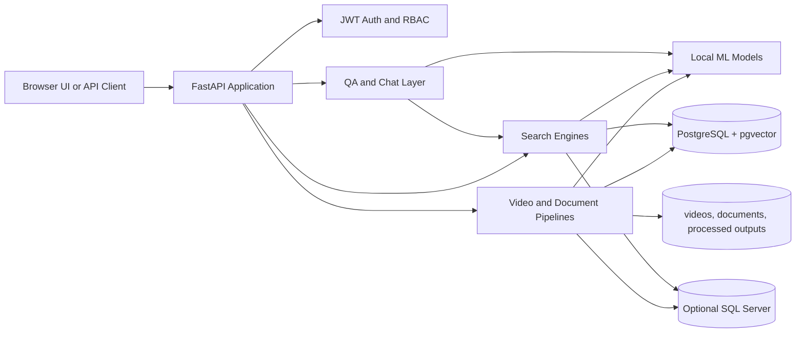
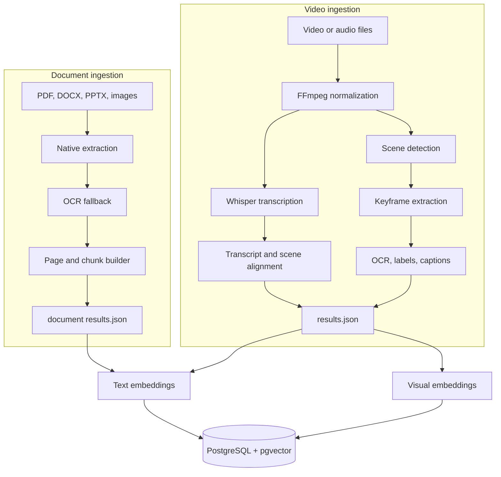
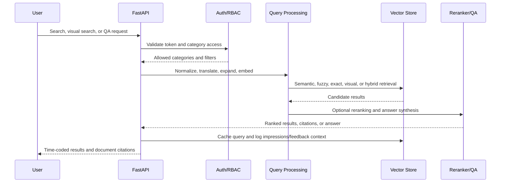
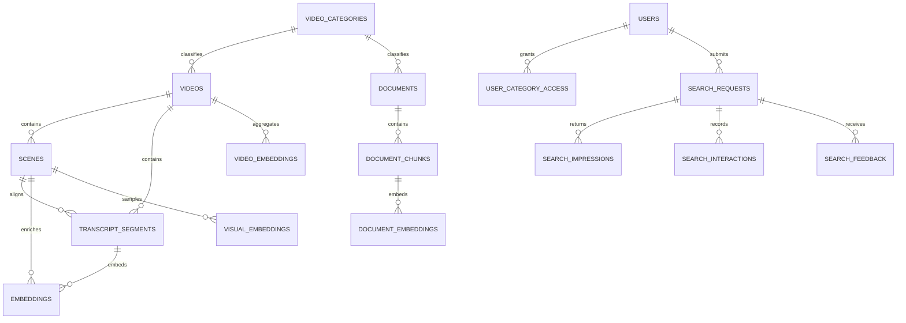

# ATLAS

AI-driven Temporal Linking and Search (ATLAS) is a multimodal retrieval and question-answering pipeline for large video and document collections. It extracts speech, scene boundaries, keyframes, OCR text, visual captions, document chunks, text embeddings, and visual embeddings, then serves semantic, fuzzy, hybrid, visual, and QA workflows through a FastAPI service and browser UI.

The project is designed for research and applied industrial search scenarios where users need to find time-coded video evidence, document passages, visual moments, and cross-modal context from natural-language queries.

## Table of Contents

- [Capabilities](#capabilities)
- [Architecture](#architecture)
- [Repository Layout](#repository-layout)
- [Prerequisites](#prerequisites)
- [Quick Start](#quick-start)
- [Configuration](#configuration)
- [Processing Workflows](#processing-workflows)
- [API Overview](#api-overview)
- [Data Model](#data-model)
- [Operations and Security](#operations-and-security)
- [Troubleshooting](#troubleshooting)
- [License](#license)

## Capabilities

- Video ingestion with Whisper Large v3 transcription, FFmpeg media normalization, PySceneDetect scene segmentation, keyframe extraction, and transcript-to-scene alignment.
- Visual enrichment with OCR, object labels, captions, SigLIP-style visual embeddings, and video-level visual aggregation.
- Document ingestion for PDF, DOCX, PPTX, and image files with native text extraction, OCR fallback, page enrichment, chunking, and embedding generation.
- Retrieval over transcripts, scenes, documents, OCR text, captions, object labels, and visual embeddings.
- Search modes for semantic text, fuzzy lexical matching, exact phrase search, visual search, image-to-video search, multimodal search, and hybrid search.
- Optional English/Norwegian query expansion and translation.
- FastAPI backend with JWT authentication, role-based category access, admin workflows, media streaming, captions, feedback logging, and OpenAI-compatible chat endpoints.
- Browser UI for authenticated search, video/document browsing, media playback, uploads, admin operations, and feedback collection.
- PostgreSQL plus pgvector as the primary vector store, with optional SQL Server ingestion and query mode support.

## Architecture

### System Architecture



### Ingestion Pipeline



### Search and QA Flow



### Core Data Model



## Repository Layout

```text
BasePipeline/
|-- api/
|   |-- app.py                    # FastAPI app, auth, search, admin, media, document endpoints
|   |-- auth.py                   # JWT auth, password hashing, role/category access helpers
|   `-- openapi.json              # API schema snapshot
|-- database/
|   |-- schema.sql                # PostgreSQL video/search/auth/vector schema
|   |-- document_schema.sql       # PostgreSQL document schema
|   |-- models.py                 # SQLAlchemy video/search/auth models
|   |-- document_models.py        # SQLAlchemy document models
|   |-- config.py                 # PostgreSQL engine and session configuration
|   |-- ingest.py                 # Video result ingestion into PostgreSQL
|   `-- SQL/                      # SQL Server schema, connection, and ingestion utilities
|-- document_ingestion/
|   |-- extractors.py             # PDF/DOCX/PPTX extraction
|   |-- ocr_engine.py             # Document OCR
|   |-- chunker.py                # Page-to-chunk conversion
|   |-- enricher.py               # Optional page enrichment
|   `-- ingest_documents.py       # Document ingestion into PostgreSQL
|-- embeddings/
|   |-- text_embeddings.py        # SentenceTransformer/Qwen text embeddings
|   `-- vision_embeddings.py      # SigLIP-style visual embeddings
|-- frontend/
|   |-- index.html                # Browser UI
|   |-- app.js                    # Search, admin, video, document interactions
|   |-- chat.js                   # QA/chat interactions
|   `-- styles.css                # UI styling
|-- llm/
|   |-- llm_manager.py            # Shared local language model loader
|   |-- query_parser.py           # Query intent parsing
|   |-- video_qa.py               # QA answer generation
|   `-- video_qa_streaming.py     # Streaming QA helper
|-- search/
|   |-- semantic_search.py        # Text/document semantic and fuzzy retrieval
|   |-- multi_modal_search.py     # Text + visual multimodal retrieval
|   |-- visual_search.py          # Visual/image search
|   |-- dual_search.py            # PostgreSQL + SQL Server merging
|   |-- sqlserver_search.py       # SQL Server retrieval path
|   |-- reranker.py               # Optional cross-encoder/LLM reranking
|   `-- query_translation.py      # Query translation and expansion
|-- training/                     # Retrieval, ASR, embedding, and reranker training utilities
|-- basic_pipeline.py             # End-to-end video processing CLI
|-- document_pipeline.py          # End-to-end document processing CLI
|-- ingest_processed_documents.py # Batch document results ingestion CLI
|-- docker-compose.yml            # PostgreSQL + pgvector service
|-- requirements.txt              # Core ML/search/runtime dependencies
`-- README.md
```

## Prerequisites

- Python 3.11 recommended.
- FFmpeg available on `PATH`.
- Docker Desktop for the default PostgreSQL/pgvector setup.
- NVIDIA GPU with CUDA is recommended for transcription, embeddings, visual enrichment, reranking, and QA. CPU mode works for smaller jobs but can be slow.
- Git LFS or external artifact storage is recommended for large media, checkpoints, dumps, and processed outputs.

## Quick Start

### 1. Create and Activate a Virtual Environment

```powershell
python -m venv .venv
.\.venv\Scripts\Activate.ps1
python -m pip install --upgrade pip
```

### 2. Install Dependencies

The repository pins CUDA 12.4 PyTorch builds in `requirements.txt`. If pip cannot resolve the `+cu124` packages from the default index, install the PyTorch packages from the CUDA 12.4 wheel index first.

```powershell
pip install --index-url https://download.pytorch.org/whl/cu124 torch==2.6.0+cu124 torchaudio==2.6.0+cu124 torchvision==0.21.0+cu124
pip install -r requirements.txt
```

The API imports FastAPI, Uvicorn, multipart upload support, JWT handling, and optional bcrypt password hashing. Install these if they are not already present in your environment:

```powershell
pip install fastapi uvicorn python-multipart PyJWT bcrypt
```

### 3. Start PostgreSQL with pgvector

```powershell
docker compose up -d
```

Validate the connection and initialize SQLAlchemy-managed tables:

```powershell
python -c "from database.config import test_connection, init_db; test_connection(); init_db()"
```

The Docker container also mounts `database/schema.sql` as an initialization script for a fresh volume.

If you plan to use document ingestion or document search, apply the document schema after the main schema:

```powershell
Get-Content -Raw database\document_schema.sql | docker exec -i video_search_db psql -U postgres -d video_semantic_search
```

### 4. Configure Environment

Create a local `.env` file. Do not commit this file.

```env
DB_HOST=localhost
DB_PORT=5432
DB_NAME=video_semantic_search
DB_USER=user
DB_PASSWORD=user

DB_QUERY_MODE=postgres
PIPELINE_INGEST_TARGET=postgres

TEXT_EMBEDDING_MODEL=Qwen/Qwen3-Embedding-0.6B
VISION_EMBEDDING_MODEL=google/siglip2-so400m-patch14-384
VISUAL_ENRICHMENT_ENABLED=true
VISUAL_ENRICHMENT_MODEL=Qwen/Qwen2.5-VL-7B-Instruct

JWT_SECRET=replace-with-a-long-random-secret
JWT_EXPIRE_HOURS=24
```

### 5. Process Videos

Process every supported file in `videos/` and ingest results into PostgreSQL:

```powershell
python basic_pipeline.py --folder videos --threshold 20
```

Process one video:

```powershell
python basic_pipeline.py --video "videos/AkerBP 1.mp4" --threshold 20
```

Generate results without database ingestion:

```powershell
python basic_pipeline.py --folder videos --skip-db
```

### 6. Process Documents

Extract and save document results:

```powershell
python document_pipeline.py --folder documents --recursive
```

Extract and ingest directly into PostgreSQL:

```powershell
python document_pipeline.py --folder documents --recursive --ingest-db
```

Ingest previously generated document results:

```powershell
python ingest_processed_documents.py --results-base processed/documents --recursive
```

### 7. Start the API and UI

```powershell
uvicorn api.app:app --host localhost --port 8000 --reload
```

Open:

```text
http://localhost:8000
http://localhost:8000/docs
```

On the first startup, the API creates a default admin user if the users table is empty:

```text
username: user
password: user
```

Change this account immediately for any shared or production-like deployment.

## Configuration

### Core Runtime Variables

| Variable                    | Default                             | Purpose                                                             |
| --------------------------- | ----------------------------------- | ------------------------------------------------------------------- |
| `DB_HOST`                   | `localhost`                         | PostgreSQL host.                                                    |
| `DB_PORT`                   | `5432`                              | PostgreSQL port.                                                    |
| `DB_NAME`                   | `video_semantic_search`             | PostgreSQL database name.                                           |
| `DB_USER`                   | `user`                              | PostgreSQL username.                                                |
| `DB_PASSWORD`               | `user`                              | PostgreSQL password.                                                |
| `DB_QUERY_MODE`             | `postgres`                          | Runtime search backend: `postgres`, `sqlserver`, or `both`.         |
| `PIPELINE_INGEST_TARGET`    | `postgres`                          | Video ingestion target: `postgres`, `sqlserver`, `both`, or `none`. |
| `TEXT_EMBEDDING_MODEL`      | `Qwen/Qwen3-Embedding-0.6B`         | Text embedding model.                                               |
| `VISION_EMBEDDING_MODEL`    | `google/siglip2-so400m-patch14-384` | Visual embedding model.                                             |
| `VISUAL_ENRICHMENT_ENABLED` | `true`                              | Enables OCR/caption/object enrichment.                              |
| `VISUAL_ENRICHMENT_MODEL`   | `Qwen/Qwen2.5-VL-7B-Instruct`       | Vision-language enrichment model.                                   |
| `SHARED_LLM_MODEL`          | `Qwen/Qwen2.5-1.5B-Instruct`        | Shared local LLM for QA/reranking helpers.                          |
| `JWT_SECRET`                | process-local random value          | JWT signing key. Set a stable secret outside development.           |
| `JWT_EXPIRE_HOURS`          | `24`                                | Access token lifetime.                                              |

### Search and Ranking Variables

| Variable                            | Default                  | Purpose                                                |
| ----------------------------------- | ------------------------ | ------------------------------------------------------ |
| `SEARCH_QUERY_TRANSLATION_ENABLED`  | `1`                      | Enables query translation and cross-language variants. |
| `SEARCH_QUERY_TRANSLATION_PROVIDER` | `mymemory`               | Translation provider: `mymemory`, `marian`, or `nllb`. |
| `SEARCH_QUERY_TRANSLATION_TARGETS`  | `en,no`                  | Target language set for query variants.                |
| `RERANKER_MODEL`                    | `Qwen/Qwen3-Reranker-4B` | Reranker model.                                        |
| `RERANKER_MODE`                     | `hybrid`                 | Reranking mode.                                        |
| `RERANKER_BLEND`                    | `0.7`                    | Blend between reranker and retrieval scores.           |
| `RERANKER_TOP_N`                    | `12`                     | Number of top results to rerank.                       |

### SQL Server Variables

Use these only when `DB_QUERY_MODE` or `PIPELINE_INGEST_TARGET` includes SQL Server.

| Variable                       | Example                | Purpose                                                   |
| ------------------------------ | ---------------------- | --------------------------------------------------------- |
| `MSSQL_CONNECTOR`              | `pyodbc` or `pytds`    | SQL Server driver path.                                   |
| `MSSQL_SERVER`                 | `localhost\SQLEXPRESS` | SQL Server host or named instance.                        |
| `MSSQL_PORT`                   | `1433`                 | Optional port for TCP connections.                        |
| `MSSQL_DATABASE`               | `VideoSemanticDB`      | SQL Server database name.                                 |
| `MSSQL_USER`                   | `sa`                   | SQL auth username when not using trusted auth.            |
| `MSSQL_PASSWORD`               | `password`             | SQL auth password.                                        |
| `MSSQL_ENABLE_TEXT_PROJECTION` | `yes`                  | Enables low-dimensional projection tables.                |
| `MSSQL_TEXT_PROJECTION_DIM`    | `1024`                 | Projection dimension for SQL Server vector compatibility. |

## Processing Workflows

### Video Pipeline

`basic_pipeline.py` is the main video entry point. It performs media conversion, transcription, scene detection, alignment, enrichment, result persistence, and optional ingestion.

Common commands:

```powershell
# Batch process videos
python basic_pipeline.py --folder videos

# Process a single file and force regeneration
python basic_pipeline.py --video "videos/example.mp4" --force

# Reuse existing processed results and only ingest
python basic_pipeline.py --ingest-only

# Skip visual enrichment for faster text-only processing
python basic_pipeline.py --folder videos --no-visual-enrichment

# Ingest into both PostgreSQL and SQL Server
python basic_pipeline.py --folder videos --ingest-target both
```

Expected outputs:

```text
processed/
|-- transcripts/
|-- scenes/
`-- results/
    `-- <video-name>/
        |-- results.json
        |-- processing_manifest.json
        `-- report.html
```

### Document Pipeline

`document_pipeline.py` processes PDF, DOCX, PPTX, and common image formats. It writes per-document `results.json` files and can ingest directly into PostgreSQL.

```powershell
# Process all documents recursively
python document_pipeline.py --folder documents --recursive

# Process one scanned PDF with OCR forced
python document_pipeline.py --file "documents/example.pdf" --force-ocr

# Process and ingest in one run
python document_pipeline.py --folder documents --recursive --ingest-db
```

Expected outputs:

```text
processed/documents/
`-- <document-name>/
    |-- results/
    |   `-- results.json
    `-- temp/
```

### SQL Server Setup

The optional SQL Server path lives under `database/SQL/`.

```powershell
sqlcmd -S "localhost\SQLEXPRESS" -E -N o -i "database\SQL\05_run_all.sql" -b
python database/SQL/test_mssql.py
python database/SQL/ingest_sqlserver.py
```

See `database/SQL/README.md` for SQL Server vector-storage details, projection tables, `pyodbc` versus `pytds`, and rebuild commands.

## API Overview

Start the service with:

```powershell
uvicorn api.app:app --host localhost --port 8000 --reload
```

Selected endpoints:

| Method | Path                          | Purpose                                          |
| ------ | ----------------------------- | ------------------------------------------------ |
| `GET`  | `/`                           | Browser UI.                                      |
| `GET`  | `/docs`                       | Interactive OpenAPI documentation.               |
| `GET`  | `/health`                     | Database, hardware, and capability health check. |
| `POST` | `/auth/login`                 | Authenticate and receive a bearer token.         |
| `GET`  | `/auth/me`                    | Return the current user.                         |
| `GET`  | `/videos`                     | List accessible videos.                          |
| `GET`  | `/videos/count`               | Count accessible videos.                         |
| `POST` | `/search`                     | Full semantic search request.                    |
| `GET`  | `/search/quick`               | Simple query-string search.                      |
| `GET`  | `/search/exact`               | Exact phrase search.                             |
| `POST` | `/search/multimodal`          | Combined text and visual search.                 |
| `POST` | `/search/visual/image`        | Image-based visual search.                       |
| `GET`  | `/search/hybrid`              | Hybrid text/visual endpoint.                     |
| `POST` | `/qa/ask`                     | Answer a question with citations.                |
| `GET`  | `/video/stream/{video_id}`    | Stream a stored video.                           |
| `GET`  | `/video/subtitles/{video_id}` | Serve generated subtitles.                       |
| `POST` | `/documents/upload`           | Upload a document.                               |
| `GET`  | `/documents`                  | List accessible documents.                       |
| `GET`  | `/documents/stream/{doc_id}`  | Stream a document file.                          |
| `POST` | `/feedback/event`             | Log implicit user feedback.                      |
| `POST` | `/feedback/rating`            | Log explicit relevance feedback.                 |
| `GET`  | `/analytics`                  | Search analytics summary.                        |
| `GET`  | `/v1/models`                  | OpenAI-compatible model list.                    |
| `POST` | `/v1/chat/completions`        | OpenAI-compatible chat completion endpoint.      |

Example search:

```powershell
curl "http://localhost:8000/search/quick?q=where+is+Omega+Alpha+well+discussed&limit=5"
```

Example authenticated request:

```powershell
$token = (Invoke-RestMethod -Method Post -Uri "http://localhost:8000/auth/login" -ContentType "application/json" -Body '{"username":"user","password":"user"}').access_token
Invoke-RestMethod -Uri "http://localhost:8000/videos" -Headers @{ Authorization = "Bearer $token" }
```

## Data Model

Primary PostgreSQL tables:

| Table                                                                             | Purpose                                                            |
| --------------------------------------------------------------------------------- | ------------------------------------------------------------------ |
| `video_categories`                                                                | Shared taxonomy for videos and documents.                          |
| `users`, `user_category_access`                                                   | Authentication and category-level authorization.                   |
| `videos`                                                                          | Source video metadata and processing metadata.                     |
| `scenes`                                                                          | Scene boundaries, keyframes, OCR, labels, and captions.            |
| `transcript_segments`                                                             | Timestamped transcript text aligned to videos and scenes.          |
| `embeddings`                                                                      | Text embeddings for transcript segments and scene enrichment text. |
| `visual_embeddings`                                                               | Frame/keyframe visual embeddings.                                  |
| `video_embeddings`                                                                | Aggregated video-level visual embeddings.                          |
| `documents`                                                                       | Source document metadata.                                          |
| `document_chunks`                                                                 | Searchable document text chunks.                                   |
| `document_embeddings`                                                             | Text embeddings for document chunks.                               |
| `query_cache`, `search_queries`                                                   | Search caching and historical query records.                       |
| `search_requests`, `search_impressions`, `search_interactions`, `search_feedback` | Learning-to-rank and feedback telemetry.                           |
| `search_image_cache`                                                              | Cached uploaded image embeddings.                                  |

The PostgreSQL schema uses pgvector HNSW indexes for vector similarity and GIN indexes for full-text search where appropriate.

## Operations and Security

- Set a stable, high-entropy `JWT_SECRET` before sharing the service.
- Replace or delete the default `admin/admin` account immediately after first startup.
- Do not commit `.env`, local media, database dumps, checkpoints, processed outputs, or private documents.
- Review CORS settings in `api/app.py` before deployment. The development configuration allows all origins.
- Keep model names and embedding dimensions aligned between ingestion, schemas, and search runtime. If changing text embedding dimensions, rebuild or migrate vector columns accordingly.
- Use external storage for large datasets and model checkpoints. GitHub repositories should stay small and source-focused.
- Treat query logs, feedback, source videos, transcripts, and documents as potentially sensitive data.

## Troubleshooting

### PostgreSQL Connection Fails

```powershell
docker compose ps
docker logs video_search_db --tail 50
python -c "from database.config import test_connection; test_connection()"
```

Check that `.env` matches the Docker defaults:

```env
DB_HOST=localhost
DB_PORT=5432
DB_NAME=video_semantic_search
DB_USER=user
DB_PASSWORD=user
```

### Port 5432 Is Already in Use

Stop the conflicting local PostgreSQL service, or change the host port mapping in `docker-compose.yml`.

### pgvector Extension Is Missing

The Docker image `pgvector/pgvector:pg16` includes pgvector. For an existing database, run:

```powershell
docker exec video_search_db psql -U postgres -d video_semantic_search -c "CREATE EXTENSION IF NOT EXISTS vector;"
```

### PyTorch CUDA Wheels Do Not Install

Install PyTorch from the CUDA 12.4 wheel index before installing the rest of the requirements:

```powershell
pip install --index-url https://download.pytorch.org/whl/cu124 torch==2.6.0+cu124 torchaudio==2.6.0+cu124 torchvision==0.21.0+cu124
pip install -r requirements.txt
```

For CPU-only machines, install CPU-compatible PyTorch wheels and expect slower processing.

### CUDA Out of Memory

Use lighter models, disable visual enrichment, skip visual embeddings, or run CPU mode for specific stages:

```powershell
python basic_pipeline.py --folder videos --no-visual-enrichment --no-visual-embeddings
```

### API Starts Slowly

The API preloads some search components and lazily loads heavier GPU models. First requests that require embeddings, reranking, visual search, or QA may download and initialize model weights.

## License

No explicit license file is currently included. Add a `LICENSE` file before public distribution so users know how the repository can be used, modified, and redistributed.
